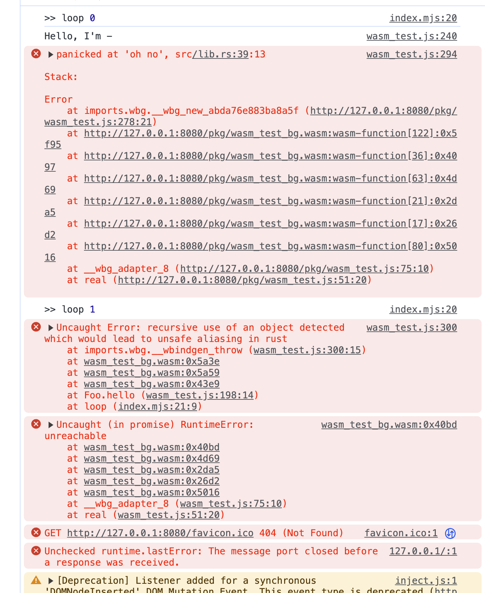

# Rust/WebAssembly testbed for "recursive use of an object" error

In Rust / WebAssembly app I sometimes get errors like "recursive use of an object detected which would lead to unsafe aliasing in rust".
I found this happens when:

- We export a `struct` from Rust as a JS class,
- We call an `async` method of the instance without `await`, and
- Another instance method is called in `reqestAnimationFrame`

This repo shows how the error be like.


## Screenshot




## How to run

```
git clone https://github.com/fand/rust-wasm-recursive-use-of-an-object-test
cd rust-wasm-recursive-use-of-an-object-test
wasm-pack build --target web
http-server .
```

then open http://localhost:8080/ and open the developer console.
